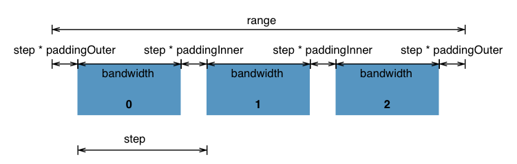

## Chart

### option
| 参数 | 说明 | 类型 | 默认值 |
|---------------------|
| type | 配置类型 | string [chart, element] | element |
| [coordinate](#coordinate) | 坐标系配置 | object | null |
| [brush](#brush) | 缩略轴配置 | object | null |
| [children](#children) | 子图表 | array | null |

### coordinate
| 参数 | 说明 | 类型 | 默认值 |
|---------------------|
| type | 坐标系类型 | string [rect, polar, ...] | rect |
| show | 是否显示坐标轴 | boolean | false |
| [x](#axis) | 坐标系x轴配置, type = rect 时有效 | object [axis] | null |
| [y](#axis) | 坐标系y轴配置, type = rect 时有效 | object [axis] | null |

#### axis
| 参数 | 说明 | 类型 | 默认值 |
|---------------------|
| type | 坐标轴类型 | string [category, value] | category |
| show | 是否显示坐标轴,如果未设置,使用coordinate的配置 | boolean | undefined |
| pickChildren | 使用子图表坐标轴进行绘制 | boolean | false |
| paddingInner | 内间距(参考图1) | number [0: 1] | 0.2 |
| paddingOuter | 外间距(参考图1) | number [0: 1] | 0.2 |
| data | 坐标轴数据, type = category 时有效 | array | null |
| max | 坐标轴最大值, type = value 时有效 | number | 自动计算得出 |
| min | 坐标轴最小值, type = value 时有效 | number | 自动计算得出 |

### brush

### children

